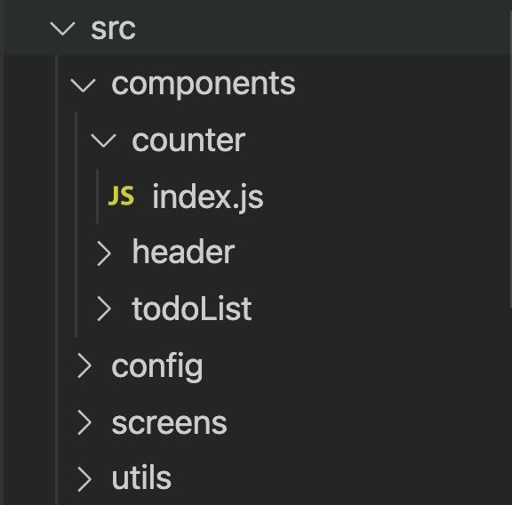

# Bonne Pratique

## Mettre en place une structure et une  nomenclature
---


### Structure

>React Native nous donne zéro structure de base, il faut donc créer la notre nous-mêmes.

* Créer un dossier ```src``` qui contiendra tout ce qui est necessaire au bon fonctionnement de votre app.

* Créer un dossier ```components``` qui contiendra vos composants.
    > Notez que chaque composant est dans un dossier: ce n'est pas anodin. Cela nous permet de créer proprement des composants (on pourra y mettre le style, les tests, etc...) 

* Créer un dossier ```config``` qui contiendra vos fichiers de configuration (initialisation des Routes, Thèmes, internationalisation, etc...)

* Créer un dossier ```screens``` qui contiendra vos pages. Les pages sont des composants comme les autres, la seule différence que l'on fait ici est logique et est faite pour avoir une structure propre. Les pages contiendront d'autres composants qui formeront la page.

* Créer un dossier ```utils``` qui contiendra vos petites fonctions qui sont utilisées un peu partout sur votre app.

### Nomenclature

La règle est simple: choisissez une règle de nommage et tenez vous-y dans toute votre app (Camel Case dans mon cas).


> Je ne vous demande pas forcément de suivre bêtement les instructions presentées ici, mais vous conseille fortement d'avoir une structure logique et propre.
